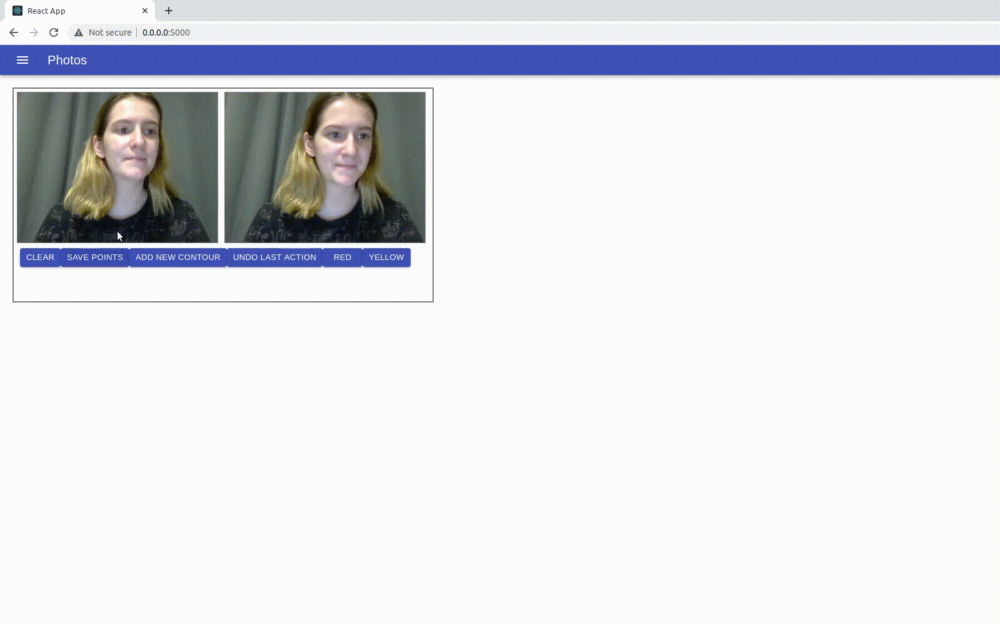

# Selection zones of interest


### Installation

To install all files for this app you need enter the following line in terminal(Linux):
```
   npm install
```


### Building

To build this app you need enter the following line in terminal(Linux):
```
   npm run build
```


### Running

To run this app you need enter the following line in terminal(Linux):
```
   python3 app.py
```
Open [http://0.0.0.0:5000/](http://0.0.0.0:5000/) to view it in the browser.

### A few words about the application



This application published photos on http://0.0.0.0:5000/ from camera.<br />
You can create markup on the image and save contours. This app uses react and flask.<br />
You **MUST** end your work with this app with click to "clear" or "save points".<br />
To add new contour in new color you **NEED** to click "add new contour" then click "yellow" or "red".<br />


### Work with this app

+ To add point - click on canvas. (When you click on canvas, image is changing to current image)
+ Clear - delete all points from an image and memory.
+ Save points - save all points, that you create.
+ Add new contour - to create new contour.
+ Undo las action - work only for last contour.
+ To add a point you need to click on canvas (left white frame).
+ Yellow - to use yellow color
+ Red - to use red color


